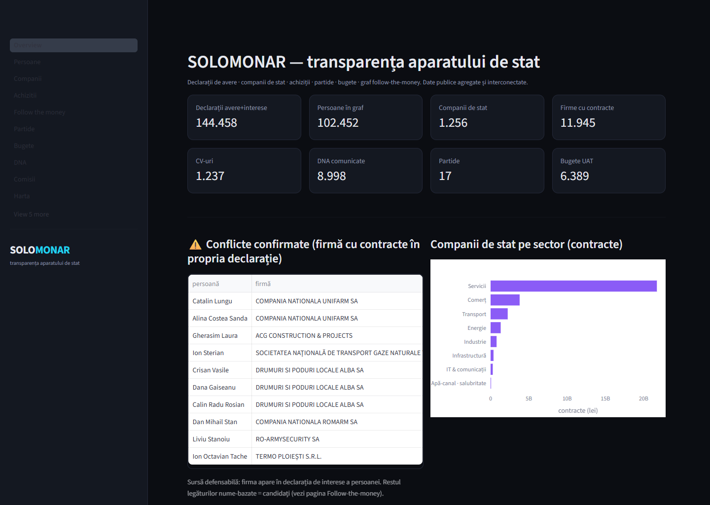
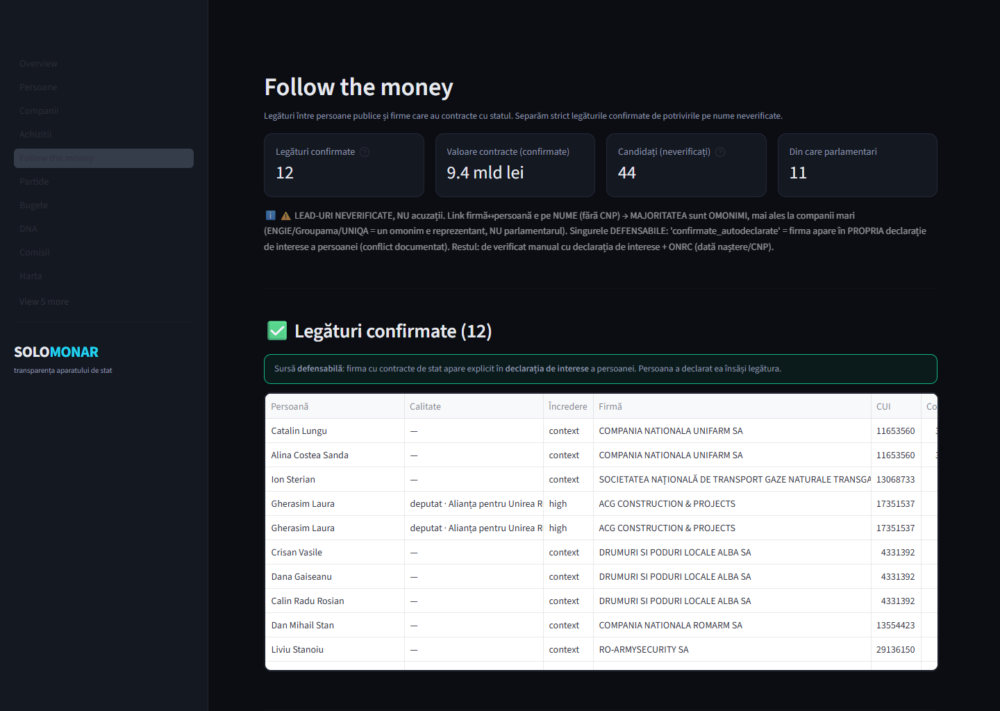
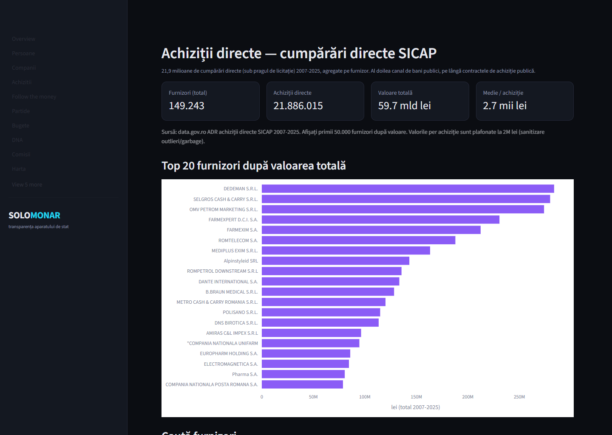
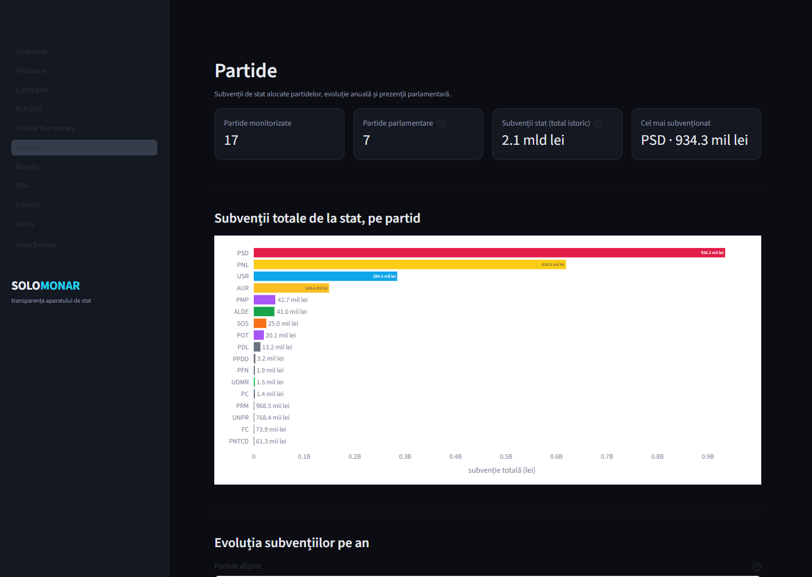
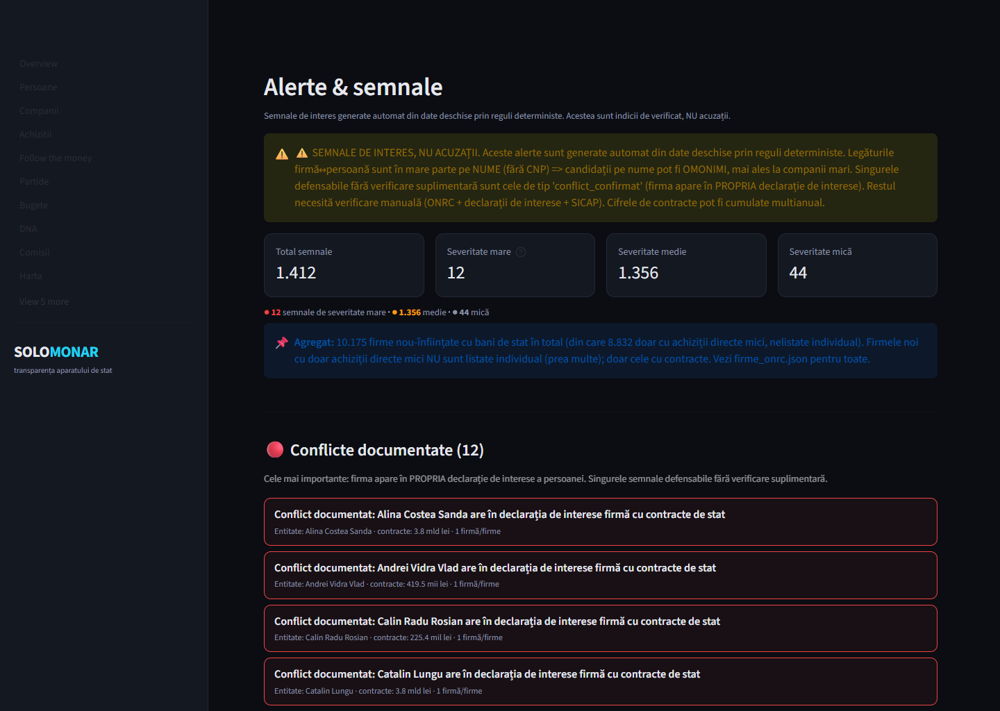

# SOLOMONAR — platforma de transparență a aparatului de stat român

> *Solomonarul* este, în mitologia românească, vrăjitorul care stăpânește **forțele nevăzute** și
> deține **cunoașterea ascunsă** (învățată la școala secretă *Șolomanța*). SOLOMONAR face exact asta cu
> statul: scoate la lumină forțele nevăzute — cine controlează ce, pe unde curg banii publici și ce
> rețele leagă oamenii de firme, de contracte și de putere.

---

## Ce este

SOLOMONAR agregă, normalizează și **interconectează** datele publice ale întregului aparat de stat
românesc — Parlament, Guvern, ministere, agenții, servicii deconcentrate, companii de stat, partide,
bugete, achiziții și justiție — într-un singur **graf „follow-the-money"**. Răspunde la întrebări pe
care sursele izolate nu le pot acoperi: *cine conduce compania de stat X și ce a declarat?*, *ce firme
ale demnitarilor au luat bani publici?*, *cum s-a schimbat averea unui oficial pe mandat?*.


*Pagina principală a aplicației „SOLOMONAR Insights" — sumarul întregii baze de date, în timp real.*

## Ce conține (date publice, agregate)

| Domeniu | Volum |
|---|---|
| **Declarații de avere și interese** | **144.458** (76.838 avere + 67.620 interese), tot OCR-izat |
| **Persoane** (graf canonic, ID stabil) | **102.452** — legate de declarații, companii, CV, partide, comisii |
| **Companii de stat + firme** | 1.256 companii de stat · **49.571 firme cu administratori** (ONRC) |
| **Achiziții publice** | 11.945 firme cu contracte SICAP · **21,9 milioane achiziții directe** (149.243 furnizori) |
| **Acționariat de stat** | % deținut la companiile listate la bursă (BVB) |
| **Partide politice** | 17 partide · subvenții de stat 2008-2026 · 402 rapoarte financiare |
| **Bugete** | 6.389 bugete locale (UAT) + bugetul consolidat lunar |
| **Justiție / integritate** | 8.998 comunicate DNA · rapoarte Curtea de Conturi · 16.498 declarații ANI central |
| **Legislativ** | 1.852 proiecte de lege ↔ inițiatori · comisii (Camera + Senat) · 668 acte normative |
| **CV-uri** | 1.237 (conducere companii de stat + parlamentari) — parcurs școlar și profesional |
| **Alerte / semnale** | 1.412 semnale automate (conflicte, firme-paravan, SOE pe pierdere cu contracte) |

## Cum funcționează (pe scurt)

1. **Colectare** — zeci de surse oficiale (cdep.ro, senat.ro, data.gov.ro, ANAF, ONRC, ANI, BVB, SICAP,
   DNA) prin scraping respectuos: OCR pe PDF-uri scanate, simulare de formulare ASP.NET, citire de
   dump-uri în masă. Fiecare document e arhivat cu **proveniență** (sursă + dată + amprentă).
2. **Rezoluție de entități** — aceeași persoană apare în zeci de surse cu nume scrise diferit, fără un
   ID comun (CNP-ul e redactat legal). SOLOMONAR o unifică într-o **identitate canonică** (`romega_id`),
   dezambiguizată pe dată de naștere + context instituțional, cu **nivel de încredere** transparent.
3. **Graf** — persoană ↔ declarații ↔ companii (rol + bilanț + contracte + achiziții directe) ↔ CV ↔
   partid (+ subvenții) ↔ comisii ↔ proiecte inițiate. Banii publici, urmăriți cap-coadă.
4. **Publicare** — totul devine **JSON static** servit gratuit prin CDN (GitHub Pages): cost zero,
   scalare, snapshot-uri imuabile. Baza de date (DuckDB) trăiește doar la build.

## Cum te conectezi și cauți informații

- **🔍 Căutare (oricine, din browser):** pagina de căutare indexează **103.725 entități** (persoane,
  companii, partide). Scrii un nume → vezi instant declarațiile, companiile conduse, contractele,
  subvenția partidului, eventuale conflicte — totul pe o singură fișă.
- **🖥️ Aplicația „SOLOMONAR Insights"** — dashboard interactiv cu **15 pagini** (filtre, grafice, fișe
  de detaliu) — rulează local sau online pe Streamlit Cloud; detalii mai jos.
- **🕸️ Grafuri interactive** — `graf.html` (rețeaua follow-the-money, layout precalculat) și
  `graf_full.html` (graful complet de 33.000 de noduri, randat pe GPU în browser).
- **🔗 API gratuit (pentru dezvoltatori/jurnaliști):** toate datele sunt fișiere JSON deschise sub
  `data/v1/` (ex. `stats.json`, `graf/persoane_gold.json`, `companii/_index.json`, `achizitii/…`).
  Plus **feed-uri** (`feed.json` / `feed.xml`) cu cele mai recente comunicate DNA.
- **🤖 Interogare conversațională (MCP):** un server Model Context Protocol expune datele pentru
  asistenți AI (Claude Desktop / Cursor) — întrebi în limbaj natural, primești răspuns cu proveniență.

## Dashboard-ul complet „SOLOMONAR Insights" (15 pagini)

Pe lângă stratul public din browser (căutare, grafuri, API), platforma include un dashboard interactiv
**Streamlit** cu cele **15 pagini**: Persoane · Companii · Achiziții · Achiziții directe ·
Follow-the-money · Partide · Bugete · DNA · Comisii · Hartă · Analytics · Alerte · Sancțiuni ·
Firme-paravan (+ Overview) — fiecare cu filtre, grafice și fișe de detaliu.

- **Local:** `streamlit run web/app/Overview.py` (Python) — rulează pe calculatorul tău, cu toate datele.
- **Online (gratuit):** publicabil pe **Streamlit Community Cloud** prin conectarea repo-ului → URL
  public, fără server propriu de întreținut.

> **Notă:** URL-ul GitHub Pages găzduiește stratul static (căutare + grafuri + API JSON). Dashboard-ul
> interactiv are nevoie de un server Python, deci rulează local sau pe Streamlit Cloud — nu direct pe
> GitHub Pages.

## Cazuri de utilizare — exemple concrete

Câteva întrebări reale la care SOLOMONAR răspunde în câteva click-uri:

**1. Jurnalist de investigație — „Are acest demnitar firme care iau bani publici?"**
Cauți numele → fișa persoanei strânge declarațiile de avere/interese, firmele unde e administrator și
contractele/achizițiile acelor firme. Pagina **Follow-the-money** arată separat legăturile **confirmate**
(firma apare în propria declarație de interese = conflict documentat) de simplele potriviri pe nume.


*„Follow-the-money" — legături confirmate (9,4 mld lei), cu separarea clară a indiciilor neverificate.*

**2. Analist economic — „Cine sunt cei mai mari furnizori ai statului?"**
Pagina **Achiziții directe** agregă 21,9 milioane de cumpărări directe pe furnizor: valoare totală,
număr, ani activi, top autorități contractante. Vezi concentrarea banilor publici și dependențele.


*„Achiziții directe" — top 20 furnizori după valoare, din 149.243 furnizori și 59,7 mld lei.*

**3. Cetățean / alegător — „Cât a primit de la stat partidul meu?"**
Pagina **Partide**: subvenția istorică de la stat (2008–2026), evoluția pe an, rapoartele financiare și
prezența parlamentară — pentru toate cele 17 partide.


*„Partide" — subvenții totale de la stat, pe partid (PSD 934 mil · PNL 619 mil · USR 284 mil lei).*

**4. ONG / watchdog — „Unde sunt semnalele de risc?"**
Pagina **Alerte** rulează reguli deterministe: companii de stat pe pierdere cu contracte mari, firme
nou-înființate cu bani publici, conflicte documentate. Fiecare semnal e un **indiciu de verificat, nu o
acuzație** — și e afișat ca atare.


*„Alerte & semnale" — 1.412 semnale automate, cu avertismentul etic afișat permanent.*

**5. Developer / cercetător — „Vreau datele brute"**
Toate datele sunt fișiere JSON deschise, fără cont — direct utilizabile într-un script:
```bash
curl https://endimion2k.github.io/solomonar/data/v1/graf/persoane_gold.json
```
Sau interoghezi conversațional prin serverul **MCP**: „Listează firmele cu contracte de stat ale
persoanei X", direct dintr-un asistent AI.

## Linkuri

- **Cod & date (open-source):** https://github.com/Endimion2k/solomonar
- **API & client (GitHub Pages):** https://endimion2k.github.io/solomonar/ — API la `…/data/v1/`, client la `…/web/`
- **Documentație:** `docs/` (arhitectură, model de date, surse, GDPR) · stare curentă: `STATE.md`

## Etică și limite (transparent)

SOLOMONAR publică **doar date deja publice**. Redactările legale (CNP, adrese, semnături) rămân
redactate — Legea 176/2010 + GDPR. Legăturile persoană↔firmă fără CNP se fac pe nume, deci unele pot fi
**omonimi** — sunt marcate clar ca „candidat / de verificat", **nu acuzații**. Comunicatele DNA sunt
trimiteri în judecată, **nu condamnări** (prezumția de nevinovăție). Doar conflictele **auto-declarate**
(firma apare în propria declarație de interese a persoanei) sunt prezentate ca documentate.

> SOLOMONAR e un **instrument de transparență și investigație** — un punct de plecare pentru întrebări,
> nu un verdict. Fiecare informație poartă sursa din care provine, ca oricine să poată verifica.
